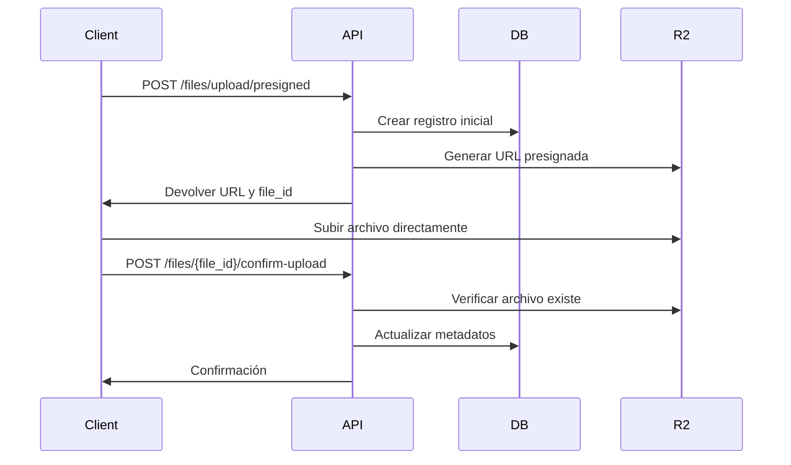
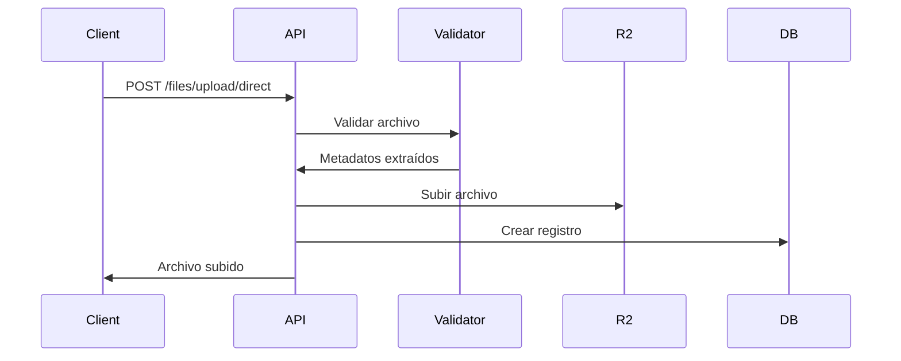
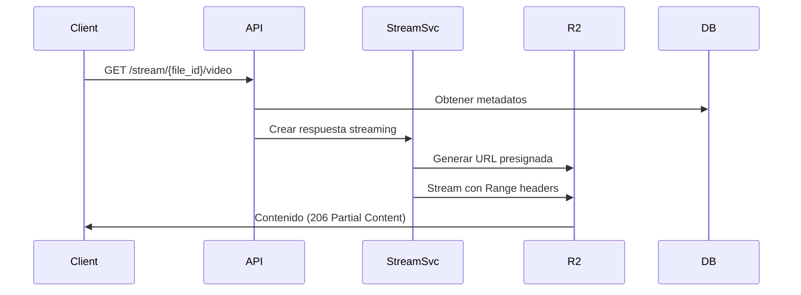

# Implementación de Almacenamiento de Archivos con Cloudflare R2

Esta implementación proporciona una solución completa y escalable para el almacenamiento de archivos de imagen y video usando Cloudflare R2 con FastAPI.

## 🏗️ Arquitectura de la Solución

### Componentes Principales

1. **Servicio R2 (`app/services/r2_service.py`)**
   - Cliente S3-compatible para Cloudflare R2
   - Generación de URLs presignadas
   - Operaciones CRUD de archivos
   - Gestión de metadatos

2. **Servicio de Validación (`app/services/file_validation.py`)**
   - Validación de tipos MIME
   - Verificación de tamaño de archivos
   - Extracción de metadatos de imágenes/videos
   - Validación de contenido

3. **Servicio de Streaming (`app/services/streaming_service.py`)**
   - Streaming progressivo de videos
   - Soporte para HTTP Range requests
   - Optimización para diferentes tipos de archivo
   - Preparado para streaming adaptativo

4. **Router de Archivos (`app/routers/files.py`)**
   - Endpoints para subida con URLs presignadas
   - Subida directa a través del servidor
   - Gestión de metadatos
   - Descarga y eliminación de archivos

5. **Router de Streaming (`app/routers/streaming.py`)**
   - Streaming optimizado para videos
   - Streaming de imágenes con cache
   - Información de streaming

## 🚀 Flujos de Trabajo

### 1. Flujo de Subida con URL Presignada (Recomendado)



**Ventajas:**
- Menor carga en el servidor API
- Subida más rápida
- Mejor escalabilidad
- Menor uso de ancho de banda del servidor

### 2. Flujo de Subida Directa



**Ventajas:**
- Validación server-side garantizada
- Control total del proceso
- Mejor para archivos pequeños

### 3. Flujo de Streaming de Video



## 📁 Estructura de Archivos en R2

```
bucket/
├── athletes/
│   └── {athlete_id}/
│       └── {year}/{month}/
│           └── {uuid}.{ext}
└── general/
    └── {year}/{month}/
        └── {uuid}.{ext}
```

## 🔧 Configuración

### Variables de Entorno Requeridas

```bash
# Cloudflare R2
R2_ACCESS_KEY_ID=your_access_key
R2_SECRET_ACCESS_KEY=your_secret_key
R2_ENDPOINT_URL=https://account-id.r2.cloudflarestorage.com
R2_BUCKET_NAME=your-bucket-name
R2_PUBLIC_DOMAIN=https://your-cdn-domain.com  # Opcional

# Configuración de archivos
MAX_FILE_SIZE=104857600  # 100MB
PRESIGNED_URL_EXPIRY=3600  # 1 hora
```

### Tipos de Archivo Soportados

**Imágenes:**
- JPEG (`image/jpeg`)
- PNG (`image/png`)
- WebP (`image/webp`)
- GIF (`image/gif`)

**Videos:**
- MP4 (`video/mp4`)
- AVI (`video/avi`)
- MOV (`video/mov`)
- WMV (`video/wmv`)
- WebM (`video/webm`)

## 🌐 Endpoints API

### Subida de Archivos

#### URL Presignada (Recomendado)
```http
POST /files/upload/presigned
Content-Type: multipart/form-data

original_filename: string
file_type: "image" | "video"
is_public: boolean (default: false)
athlete_id: int (optional)
```

#### Subida Directa
```http
POST /files/upload/direct
Content-Type: multipart/form-data

file: File
file_type: "image" | "video"
is_public: boolean (default: false)
athlete_id: int (optional)
```

### Gestión de Archivos

```http
# Listar archivos
GET /files/?athlete_id=1&file_type=image&limit=50

# Obtener archivo específico
GET /files/{file_id}

# Actualizar metadatos
PATCH /files/{file_id}

# Eliminar archivo
DELETE /files/{file_id}?hard_delete=false
```

### Streaming

```http
# Stream de video con soporte Range
GET /stream/{file_id}/video

# Stream de imagen optimizado
GET /stream/{file_id}/image

# Stream genérico
GET /stream/{file_id}/raw

# Información de streaming
GET /stream/{file_id}/info
```

### Descarga

```http
# Descargar archivo (redirección)
GET /files/{file_id}/download

# Obtener URL presignada de descarga
GET /files/{file_id}/presigned-url?expires_in=3600
```

## 🎯 Mejores Prácticas

### 1. Subida de Archivos

- **Usa URLs presignadas** para archivos grandes (>10MB)
- **Usa subida directa** para archivos pequeños que requieren validación estricta
- **Implementa progress callbacks** en el cliente para URLs presignadas
- **Valida en el cliente** antes de solicitar URLs presignadas

### 2. Streaming

- **Usa endpoints específicos** (`/stream/{id}/video` vs `/stream/{id}/raw`)
- **Implementa Range requests** en clientes de video
- **Configura cache apropiado** para imágenes
- **Considera CDN** para contenido público

### 3. Gestión de Archivos

- **Usa soft delete** por defecto
- **Implementa cleanup jobs** para hard delete periódico
- **Organiza por athlete_id** para mejor estructura
- **Monitorea tamaños de bucket** regularmente

### 4. Seguridad

- **Valida siempre server-side** para subidas críticas
- **Usa URLs presignadas con TTL corto** para contenido sensible
- **Implementa rate limiting** en endpoints de subida
- **Audita accesos** a archivos privados

## 📊 Escalabilidad

### Consideraciones de Rendimiento

1. **URLs Presignadas**: Reducen carga del servidor en 80-90%
2. **Streaming**: Soporte nativo para Range requests
3. **Caching**: Headers optimizados para CDN
4. **Async**: Todas las operaciones son asíncronas

### Límites y Configuración

- **Tamaño máximo por archivo**: 100MB (configurable)
- **TTL URLs presignadas**: 1 hora (configurable)
- **Chunk size streaming**: 8KB (optimizable)
- **Concurrencia**: Configurado para 50 conexiones simultáneas

## 🔍 Monitoreo y Logging

### Métricas Importantes

- Tiempo de respuesta de URLs presignadas
- Tasa de éxito/fallo en subidas
- Uso de bandwidth por tipo de archivo
- Errores de validación por tipo

### Logs Estructurados

```python
# Ejemplo de logs generados
logger.info(f"Generated presigned upload URL for key: {file_key}")
logger.error(f"File validation error: {error}")
logger.info(f"Successfully uploaded file: {filename} as {file_key}")
```

## 🚨 Manejo de Errores

### Errores Comunes y Soluciones

1. **File too large**: Configurar `MAX_FILE_SIZE`
2. **Invalid MIME type**: Verificar `ALLOWED_*_TYPES`
3. **R2 connection failed**: Verificar credentials y endpoint
4. **Presigned URL expired**: Reducir TTL o implementar renovación

### Códigos de Error HTTP

- `400`: Validación de archivo fallida
- `404`: Archivo no encontrado
- `413`: Archivo demasiado grande
- `500`: Error de storage o servidor

## 🔄 Extensibilidad Futura

### Funcionalidades Preparadas

1. **Streaming Adaptativo**: Base para HLS/DASH
2. **Procesamiento de Imágenes**: Hooks para redimensionamiento
3. **Transcoding de Video**: Estructura para múltiples formatos
4. **CDN Integration**: URLs públicas configurables

### Integración con Otros Servicios

- **Cloudflare Images**: Para optimización automática
- **Cloudflare Stream**: Para video streaming avanzado
- **Workers**: Para procesamiento edge
- **Analytics**: Para métricas detalladas

## 📚 Ejemplos de Uso

### Cliente JavaScript (Subida con URL Presignada)

```javascript
// 1. Solicitar URL presignada
const formData = new FormData();
formData.append('original_filename', file.name);
formData.append('file_type', 'image');
formData.append('is_public', 'true');

const response = await fetch('/files/upload/presigned', {
    method: 'POST',
    body: formData
});

const uploadData = await response.json();

// 2. Subir archivo directamente a R2
await fetch(uploadData.upload_url, {
    method: 'PUT',
    body: file,
    headers: {
        'Content-Type': file.type
    }
});

// 3. Confirmar subida
await fetch(`/files/${uploadData.file_id}/confirm-upload`, {
    method: 'POST'
});
```

### Cliente HTML5 Video

```html
<video controls>
    <source src="/stream/123/video" type="video/mp4">
    Tu navegador no soporta video HTML5.
</video>
```

Esta implementación te proporciona una base sólida y escalable para el manejo de archivos multimedia con Cloudflare R2, siguiendo las mejores prácticas de la industria.